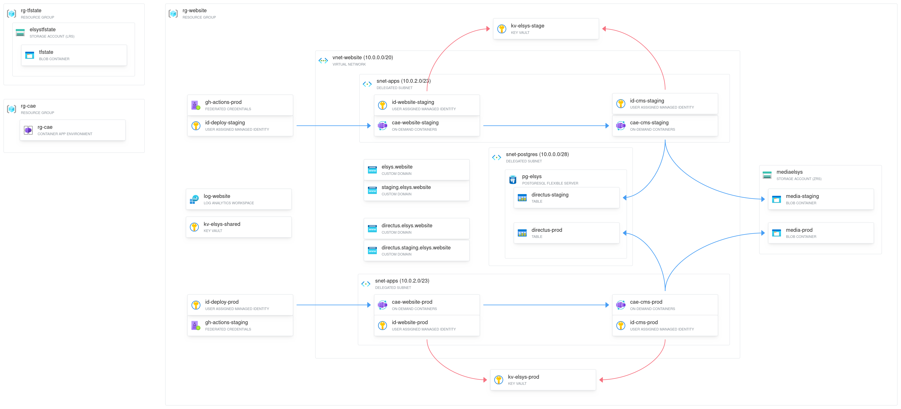

# websaitut-infra


**[English](README.en.md) | Български**

---

Това е Terraform конфигурацията за инфраструктурата на уебсайта на ТУЕС върху Microsoft Azure. Едно `terraform apply` описва цялата платформа: контейнер приложенията, базата, тайните, мрежата и identity-тата за CI/CD.

> [!NOTE] 
> Сайтът е разработван като проект по проектно-базираното обучение в ТУЕС и първоначално беше deploy-нат на самостоятелно администриран k3s клъстър — с Flux за GitOps, Traefik, Vault и VictoriaMetrics. Тази конфигурация е архивирана на [Codeberg](https://codeberg.org/rangelovkiril/tues-website-infra). Настоящото хранилище съдържа наследника ѝ — управляваната чрез Terraform Azure инфраструктура.

## Архитектура



## Стек

| Слой | Ресурс | Бележки |
|---|---|---|
| Compute | Azure Container Apps | Общ environment (Consumption); по два app-а на среда, website (Next.js) и CMS (Directus) |
| База | PostgreSQL Flexible Server | v17, B1ms, изцяло частен; отделни бази за staging и prod |
| Тайни | Azure Key Vault | Общ плюс по един на среда, с RBAC; opt-in firewall на data plane |
| Съхранение | Azure Storage | Медията на Directus; отделен контейнер на среда |
| Мрежа | VNet и подмрежи | Delegated subnet за PostgreSQL, частна DNS зона |
| CI/CD | User-assigned identities | OIDC federation към GitHub Actions, роли с най-малка привилегия |

## Среди

Staging и prod се управляват от **един** state чрез `for_each` върху locals, без дублиран код. Staging скалира до нула реплики (`min_replicas = 0`), prod държи поне една.

## Структура

```
live/                   # активната инфраструктура — тук работиш всекидневно
├── *.tf                 # root: RG, мрежа, платформа, база, vault-ове, приложения, identity-та
├── terraform.tfvars     # входни стойности (без тайни)
└── modules/
    ├── networking/      # VNet, подмрежи, частни DNS зони
    ├── database/        # PostgreSQL Flexible Server
    ├── key_vault/       # Key Vault, RBAC и firewall
    └── container_app/   # преизползваем Container App (probes, secrets, registry, домейни)

bootstrap/               # еднократно: създава state backend-а на live/ — виж bootstrap/README.md
```

## CI/CD

Образите се билдват в [приложението](https://github.com/TUES-2026-PBL-11-klas/websaitut) и се пушват в GHCR. Деплойът е `az containerapp update --image`, изпълняван от deploy identity на съответната среда през OIDC (без дълготрайни тайни в GitHub). Terraform има `ignore_changes` на image, за да не се бие с деплоите.

## Тайни

Стойностите се seed-ват ръчно в Key Vault при първоначално създаване. **Terraform не чете тайни** — реферира ги по конструиран URI, а приложенията ги резолват при рънтайм през своите managed identity-та. PostgreSQL admin паролата идва от `TF_VAR_pg_admin_password` (или gitignore-нат `*.secret.tfvars`).

## Как се пуска

При чисто нов subscription, първо еднократно [`bootstrap/`](bootstrap/README.md) — създава state backend-а, преди `live/` да може да направи `init`.

```bash
cd live
export TF_VAR_pg_admin_password="..."   # изважда се от Key Vault
terraform init
terraform plan
terraform apply
```

State-ът се пази в Azure Storage backend (`rg-tfstate/elsystfstate`), създаден от `bootstrap/`.

## Предстои

Отворени milestone-и в хранилището: наблюдаемост (alerting, availability), FinOps (budget alerts), активиране на Key Vault firewall и custom domains за staging.
